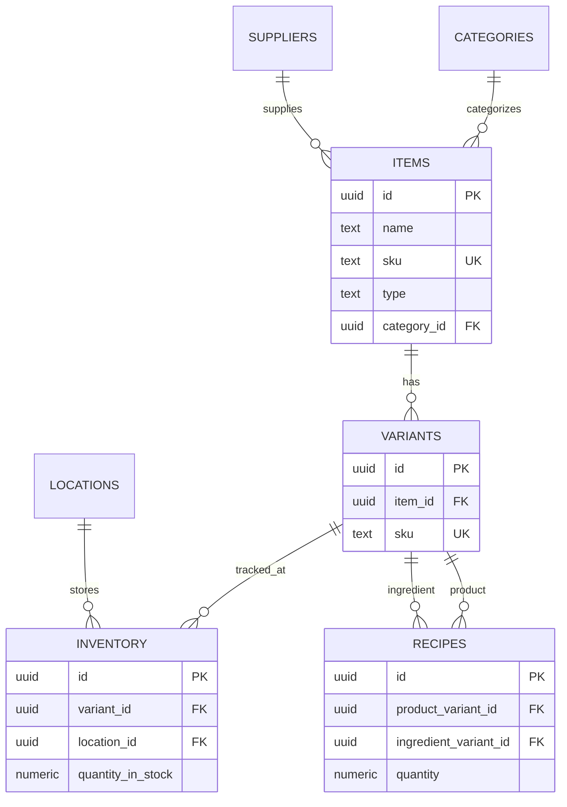

# Current Database Schema

**Generated:** 2025-12-10  
**Database:** Supabase PostgreSQL (foggedeapevnksvhcrgp)  
**Schema:** public

---

## Table Summary

| Table Name | Rows | Purpose |
|------------|------|---------|
| `items` | 318 | Base products and materials |
| `variants` | 332 | SKU-level configurations |
| `recipes` | 0 | Bill of Materials (BOM) |
| `inventory` | 303 | Stock levels per location |
| `batches` | 0 | Batch/lot tracking |
| `categories` | 15 | Item categorization |
| `suppliers` | 82 | Vendor management |
| `locations` | 2 | Warehouses/storage |
| `tax_rates` | 1 | Tax configurations |
| `customers` | 2 | Customer records |
| `sales_orders` | 2 | Customer orders |
| `sales_order_rows` | 0 | Order line items |
| `purchase_orders` | 0 | Supplier orders |
| `purchase_order_rows` | 0 | PO line items |
| `manufacturing_orders` | 144 | Production orders |
| `operations` | 0 | Base operations table |
| `product_operations` | 0 | Product-specific operations |
| `manufacturing_order_operations` | 144 | MO operation details |

---

## Detailed Table Structures

### `items` Table

**Purpose:** Core table for all products and materials

| Column | Type | Nullable | Default | Description |
|--------|------|----------|---------|-------------|
| `id` | uuid | NO | uuid_generate_v4() | Primary key |
| `name` | text | NO | - | Item name |
| `sku` | text | NO | - | Unique stock keeping unit |
| `type` | text | YES | - | 'product' or 'material' |
| `category_id` | uuid | YES | - | FK to categories |
| `uom` | text | NO | 'pcs' | Unit of measure |
| `is_sellable` | boolean | YES | FALSE | Can be sold |
| `is_purchasable` | boolean | YES | FALSE | Can be purchased |
| `is_producible` | boolean | YES | FALSE | Can be manufactured |
| `is_batch_tracked` | boolean | YES | FALSE | Batch tracking enabled |
| `default_purchase_price` | numeric(10,2) | YES | 0 | Default buy price |
| `default_sales_price` | numeric(10,2) | YES | 0 | Default sell price |
| `batch_tracking_enabled` | boolean | YES | FALSE | Legacy batch tracking flag |
| `default_supplier_id` | uuid | YES | NULL | FK to suppliers |
| `purchase_uom` | text | YES | NULL | Purchase unit of measure |
| `conversion_rate` | numeric(10,5) | YES | 1 | Conversion between UOMs |
| `created_at` | timestamptz | YES | NOW() | Creation timestamp |
| `updated_at` | timestamptz | YES | NOW() | Last update timestamp |

**Constraints:**
- PRIMARY KEY: `id`
- UNIQUE: `sku`
- CHECK: `type IN ('product', 'material')`
- FOREIGN KEY: `category_id` → `categories(id)`
- FOREIGN KEY: `default_supplier_id` → `suppliers(id)`

---

### `variants` Table

**Purpose:** SKU-level configurations of items (for size, color, etc.)

| Column | Type | Nullable | Default | Description |
|--------|------|----------|---------|-------------|
| `id` | uuid | NO | uuid_generate_v4() | Primary key |
| `item_id` | uuid | YES | - | FK to items |
| `sku` | text | NO | - | Variant SKU (must be unique) |
| `option1_name` | text | YES | NULL | First variant option name |
| `option1_value` | text | YES | NULL | First variant option value |
| `option2_name` | text | YES | NULL | Second variant option name |
| `option2_value` | text | YES | NULL | Second variant option value|
| `option3_name` | text | YES | NULL | Third variant option name |
| `option3_value` | text | YES | NULL | Third variant option value |
| `sales_price` | numeric(10,2) | YES | NULL | Override sales price |
| `purchase_price` | numeric(10,2) | YES | NULL | Override purchase price |
| `internal_barcode` | text | YES | NULL | Internal barcode |
| `registered_barcode` | text | YES | NULL | Official barcode (GTIN/EAN) |
| `created_at` | timestamptz | YES | NOW() | Creation timestamp |

**Constraints:**
- PRIMARY KEY: `id`
- UNIQUE: `sku`
- FOREIGN KEY: `item_id` → `items(id)` ON DELETE CASCADE

---

### `recipes` Table

**Purpose:** Bill of Materials - defines what ingredients make up a product

| Column | Type | Nullable | Default | Description |
|--------|------|----------|---------|-------------|
| `id` | uuid | NO | uuid_generate_v4() | Primary key |
| `product_variant_id` | uuid | YES | - | FK to variants (the product) |
| `ingredient_variant_id` | uuid | YES | - | FK to variants (the ingredient) |
| `quantity` | numeric(12,4) | NO | - | Amount of ingredient needed |
| `wastage_percentage` | numeric(5,2) | YES | 0 | Expected wastage % |
| `created_at` | timestamptz | YES | NOW() | Creation timestamp |

**Constraints:**
- PRIMARY KEY: `id`
- FOREIGN KEY: `product_variant_id` → `variants(id)` ON DELETE CASCADE
- FOREIGN KEY: `ingredient_variant_id` → `variants(id)`

**⚠️ Current Status:** 0 rows - No BOM data seeded

---

### `inventory` Table

**Purpose:** Tracks stock levels for each variant at each location

| Column | Type | Nullable | Default | Description |
|--------|------|----------|---------|-------------|
| `id` | uuid | NO | uuid_generate_v4() | Primary key |
| `variant_id` | uuid | YES | - | FK to variants |
| `location_id` | uuid | YES | - | FK to locations |
| `quantity_in_stock` | numeric(12,4) | YES | 0 | Physical stock on hand |
| `quantity_committed` | numeric(12,4) | YES | 0 | Reserved for orders |
| `quantity_expected` | numeric(12,4) | YES | 0 | Incoming from POs/MOs |
| `reorder_point` | numeric(12,4) | YES | 0 | Min stock before reorder |
| `average_cost` | numeric(12,4) | YES | 0 | Moving average cost |
| `quantity_potential` | numeric(12,4) | YES | 0 | Available to use |
| `value_in_stock` | numeric(12,4) | YES | 0 | Total value (cost × qty) |
| `safety_stock_level` | numeric(12,4) | YES | 0 | Safety stock threshold |
| `default_storage_bin` | text | YES | NULL | Storage location |

**Constraints:**
- PRIMARY KEY: `id`
- UNIQUE: (`variant_id`, `location_id`)
- FOREIGN KEY: `variant_id` → `variants(id)` ON DELETE CASCADE
- FOREIGN KEY: `location_id` → `locations(id)` ON DELETE CASCADE

---

### `operations` Table

**Purpose:** Base operations/resources table

**⚠️ Current Status:** 0 rows - Table exists but empty

---

### `product_operations` Table

**Purpose:** Defines production operations for products

**⚠️ Current Status:** 0 rows - Table exists but empty

---

### `manufacturing_order_operations` Table

**Purpose:** Tracks actual operations performed during manufacturing

**✅ Current Status:** 144 rows - Populated with MO operation data

---

## Key Relationships



---

## Critical Findings

### ✅ Well-Structured Tables
- **items** and **variants** are properly separated
- **recipes** table structure is correct for BOM
- **inventory** has comprehensive tracking fields

### ⚠️ Empty Critical Tables
1. **recipes** (0 rows) - No Bill of Materials data
   - **Impact:** Cannot calculate product costs
   - **Impact:** "Recipe" tab on item details will be empty
   
2. **sales_order_rows** (0 rows) - Sales orders have no line items
   - **Impact:** Sales orders exist but incomplete

3. **operations** (0 rows) - No base operations defined
   - **Impact:** Cannot track production operations/costs

4. **product_operations** (0 rows) - No product-specific operations
   - **Impact:** "Operations" tab will be empty

### 🔧 Implementation Needs

**To make Item Creation functional, we need:**

1. ✅ **items** table - Ready
2. ✅ **variants** table - Ready
3. ⚠️ **recipes** table - Ready but empty (needs UI to populate)
4. ⚠️  **operations/product_operations** - Tables exist but need UI

**Missing UI Components:**
- "Add Ingredient" functionality for recipes table
- "Add Operation" functionality for operations
- Auto-generate variant functionality
- SKU generation logic

---

## Sample Data Structure

### Sample Item
```json
{
  "id": "b7afe6ed-f4f7-4eb9-82a4-5087f",
  "name": "New Product",
  "sku": "GEN-1676",
  "type": "product",
  "category_id": "f7070b8f-c0c2-4c29-a984-b4543",
  "uom": "pcs",
  "is_sellable": true,
  "is_purchasable": false,
  "is_producible": true
}
```

### Sample Variant
```json
{
  "id": "1cdbdce6-e987-42aa-b97d-17238",
  "item_id": "182eaf0c-235b-4382-bf78-9dffb",
  "sku": "NI-NAPKINS",
  "sales_price": 0,
  "purchase_price": 4.16
}
```

### Sample Inventory Record
```json
{
  "id": "d30eb7f6-28dd-4781-a3e8-936c9",
  "variant_id": "f7a36868-b440-4c11-85ca-1ee06",
  "location_id": "c7ce4281-1eb0-4ed5-a050-396f0",
  "quantity_in_stock": 0,
  "average_cost": 0.5724
}
```

---

## Next Steps

1. **Frontend Audit** - Find existing item creation components
2. **Implement "Add Ingredient"** - Most critical missing feature
3. **Implement "Add Operation"** - For production costing
4. **Test Full Workflow** - Create item → Add ingredients → Verify costs
